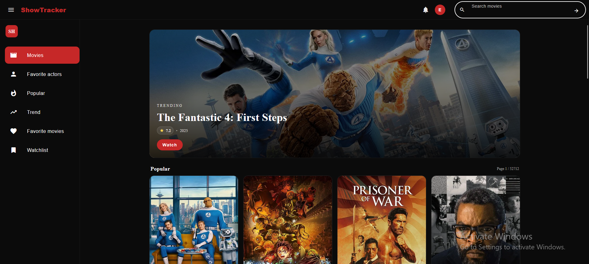

# ShowTracker

**ShowTracker** is a full-stack web application that allows users to search, track, and manage their favorite movies and TV series.  
It leverages the [TMDB API](https://www.themoviedb.org/) to provide real-time data and integrates secure authentication, personalized watchlists, and favorites.


## Application 

### Login 


### Login 


### Home Page


### Home Page


### Favorites


### Popular 


### Trend 


##  Tech Stack

**Frontend**
- Angular 19  
- TailwindCSS / Angular Material  

**Backend**
- Node.js (Express.js)  
- Prisma ORM  
- PostgreSQL  
- Redis (for caching)  
- JWT Authentication  

**DevOps & Tools**
- Docker / Docker Compose  
- GitHub Actions (CI/CD pipeline)  
- Playwright (E2E tests)  
- Jest (unit tests)  

---

## 📦 Installation & Setup

### Prerequisites
- [Node.js](https://nodejs.org/) >= 18  
- [PostgreSQL](https://www.postgresql.org/)  
- [Redis](https://redis.io/)  
- [Docker](https://www.docker.com/) (optional, for containerized setup)  

### Clone the repository
```bash
git clone https://github.com/AnassEREKYSY/ShowTracker.git
cd ShowTracker
```
### Environment Variables
Create a .env file in the root

### Run locally

Backend 
```bash
cd server
npm install
npx prisma migrate dev
npm run dev
```

Frontend 
```bash
cd client
npm install
ng serve
```

Unit Tests 
```bash
npm run test
```

E2E Tests 
```bash
npx playwright test
```
### CI/CD
The project includes a GitHub Actions pipeline that:
- Runs unit & E2E tests
- Builds client & server Docker images
- Pushes them to Docker Hub

